# Vector

## Definition
- Vector is an object, or a list of attributes that move around space.
- Two main properties of a Vector:
    - Length
    - Direction

## Operations
- **Addition:**
    - **Associative**:

        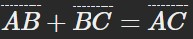

    - **Method**: Add up the components of two vector
        
        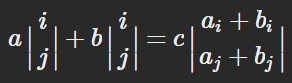

- **Multiplication by a Scalar:**
    - **Method**: Multiple the components of the vector with the Scalar
        
        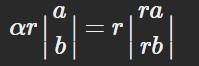

        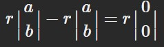

        - `r` and `ar` ( with a is `a` Scalar ) will have the same direction if `a` is position.

- **Size of a Vector (Length):**
    - **Method:** Size of a Vector equal to the sum of the squares of its components.

        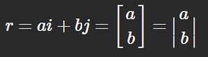
        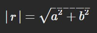

- **Dotted product of two Vector:**
    - **Method:** Multiplying the first component of two Vectors together and then add it to the result of multiplying the second component of two Vectors.
        - The result will be a Scalar number.
        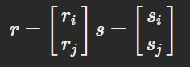
        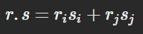
        
        - **Commutitive**:

            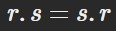

        - **Distributive over addition:**

            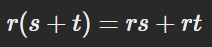

        - **Associative over Scalar multiplication:**

            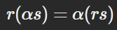

- **Relationship between the dot product and the length (modulus) of a vector:**
    - If we want to get the size of a Vector, we dotting the Vector with itself and taking the square root.

    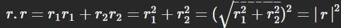

- **Cosine and Dot product:**
    - **Use case:** The Dot product with the Cosine shows us whether the two Vector go in the same direction.
        - The result will be between 0 and 1.

            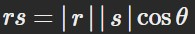